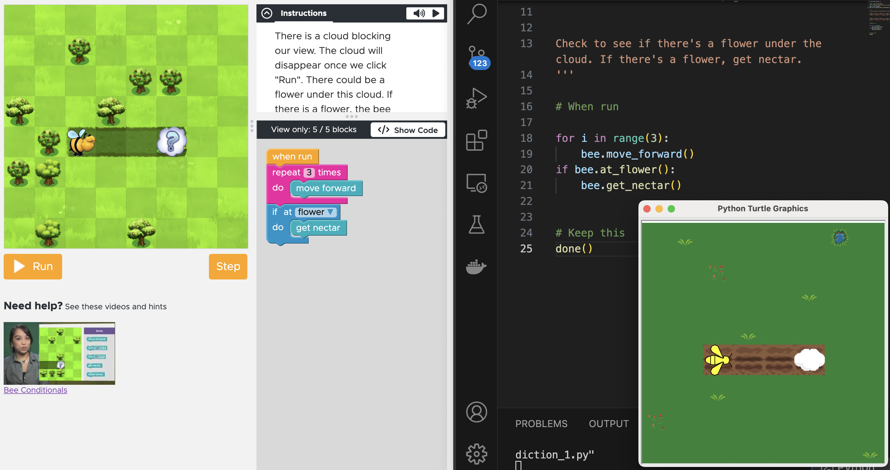

# What is this?

This is a small python module that allows you solve some of the challenges from code.org in python.
It is meant as a stepping stone from block programming to written code.

Using the `importer` modules, the lessons and their levels can be imported from the code.org
codebase and python files are generated accordingly, for students to start coding the solution.
This is an example of what it looks like side-by-side with the "If/Else with Bee" lesson. On the left is code.org, and on the right is the same level, solved in python. And bottom right is the Turtle graphics window that shows the level.

Only lessons that code.org have released under Creative Commons license are imported and re-shared in this repo. Although with alternative artwork, as code.org holds exclusive rights to their own artwork.

# How to use it?

1. Clone this repo
2. Create a python environment, either with your IDE or with the command `python -m venv .venv`
3. Install the maze module with pip `pip install -e maze`
4. Open a challenge file and try it out, e.g. from the `coursed-2023/14 - Conditionals - If-Else with Bee`

# Artwork Attribution

Code.org has exclusive rights to their artwork and graphics, so I had to find alternative artwork from elsewhere.

The graphics and artwork is found on https://opengameart.org/
Specific mentions should go to the following for the bits I used.

## Maze Games

### Bee

* Honeycomb from [Admurin's Insect Items](https://opengameart.org/content/admurins-insect-items)
* Grass background from [LPC Tile Atlas](https://opengameart.org/content/lpc-tile-atlas)
* Flowers from [Plants and Flowers - Pixel Art](https://opengameart.org/content/plants-and-flowers-pixel-art)

### Plants vs. Zombies

* Ground tiles from [Whispers of Avalon: Grassland Tileset](https://opengameart.org/content/whispers-of-avalon-grassland-tileset)
* Evil Flower obstacle from: [Bevouliin Free sprite sheets - Plant Monster](https://opengameart.org/content/bevouliin-free-sprite-sheets-plant-monster)
* Sunflower from [Plants and Flowers - Pixel Art](https://opengameart.org/content/plants-and-flowers-pixel-art)

### Farmer aka. Harvester

* Crops from [LPC Crops](https://opengameart.org/content/lpc-crops)
* Background from [LPC Farming tilesets, magic animations and UI elements](https://opengameart.org/content/lpc-farming-tilesets-magic-animations-and-ui-elements)